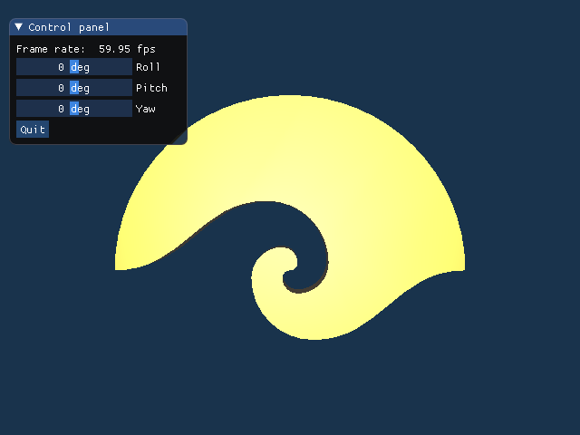

# ggsample01

## ゲームグラフィックス特論A　第１回　宿題

OpenGL の開発環境を整備してください。

* 宿題のひな形は [GitHub](https://github.com/tokoik/ggsample01) にあります
 (宿題のひな形で使っている[補助プログラムの解説](https://tokoik.github.io/gg/html/annotated.html))。
* 詳しくは[講義のスライド](https://tokoik.github.io/gg/ggnote01.pdf)を参照してください。

## 宿題プログラムの作成に必要な環境

* Linux Mint 22.1 (Xia), gcc 13.3.0 以降 (libglfw3-dev, libgtk-3-dev, pkg-config 必須)。
* macOS 26.4 (Tahoe), Xcode 26.4 以降 (Intel / Apple 両対応)。
* Windows 11 (Win32/x64), Visual Studio 2022 以降 (“C++ によるデスクトップ開発” 必須)。
* OpenGL 4.1 以降が実行できる環境 (対応した GPU を搭載したビデオカード や CPU) が必要です。

## 宿題の提出

* このプロジェクトをビルド・実行して表示されたウィンドウのスクリーンショットを Moodle にアップロードしてください。
* 気力があったら表示図形が回転するようにして (AI 使用可)、そのムービー (10MB 以下) を送ってください。

## 補足

このプログラムを実行すると、次のような図形が表示されます。

 

* macOS では Intel CPU と Apple Silicon の両方に対応した Universal Binary を作成するようにしています。
* Raspberry Pi 4B にも対応しました。`make -f Makefile.rpi` でビルドしてください。
* ひな形プログラムがコンパイル／実行できなかったら知らせてください。
* fork 推奨ですが解答を PR で受け取る**気力はありません**。

## 宿題プログラム用補助プログラムについて

ゲームグラフィックス特論 A / B で課す宿題プログラムでは、専用の補助プログラムを用意しています。これは以下の 5 つのファイルで構成されています。

* [gg.h](https://github.com/tokoik/ggsample01/blob/master/gg.h) / [gg.cpp](https://github.com/tokoik/ggsample01/blob/master/gg.cpp)
  * GLFW での利用を想定した OpenGL のローダとユーティリティ
* [GgApp.h](https://github.com/tokoik/ggsample01/blob/master/GgApp.h) / [GgApp.cpp](https://github.com/tokoik/ggsample01/blob/master/GgApp.cpp)
  * ウィンドウやマウス関連のユーザインタフェースを管理する GLFW のラッパー
* [main.cpp](https://github.com/tokoik/ggsample01/blob/master/main.cpp)
  * メインプログラム

[GLFW](https://www.glfw.org/) は [OpenGL](https://www.opengl.org/) や、その後継の [Vulkan](https://www.vulkan.org/) を使用したアプリケーションを作成するための、非常にコンパクトなフレームワークです。本当はこれだけで簡単にアプリケーションが作れるのですが、授業内容とはあまり関係のない処理を分離するために、屋上屋ながら**この授業専用の**フレームワークを用意しました。なお、gg.h / gg.cpp には OpenGL の拡張機能を使用可能にする機能を含んでいるので、別に [GLEW](http://glew.sourceforge.net/) や [glad](https://github.com/Dav1dde/glad)、[GL3W](https://github.com/skaslev/gl3w) などを導入する必要はありません。

また、この補助プログラムは [Dear ImGui](https://github.com/ocornut/imgui) をサポートする機能を含んでいます。このプログラム ([ggsample01](https://github.com/tokoik/ggsample01)) には、その使い方のサンプルコードを示すために、Dear ImGui のソースプログラムも含めています。日本語メニューの表示のために [M+ FONTS](https://mplusfonts.github.io/) の [Mplus1-Regular.ttf](https://github.com/coz-m/MPLUS_FONTS/blob/master/fonts/ttf/Mplus1-Regular.ttf) もリポジトリに含めています。

このほか、この GgApp.h / GgApp.cpp には Oculus Rift (DK1, DK2, CV1, S) をサポートする機能を組み込んでいます。ただし、これらは既にディスコンになっています ([OpenXR](https://www.khronos.org/openxr/) に移行予定)。これら (もしくは Meta Quest 2 / 3 / 3S) を持っているなら、(かつては) この補助プログラムを使って、C++ だけで VR アプリケーション () が作れていました。

### 補助プログラムのドキュメント

Doxygen で生成したドキュメントの [HTML 版](html/index.html)を html フォルダに、[PDF 版](pdf/refman.pdf)を pdf フォルダに置いています。

### 補助プログラムの使い方

補助プログラムを使用するには、最小限、GLFW が使える環境が必要です。ゲームグラフィックス特論 A / B の宿題のリポジトリには Windows 用および macOS 用にコンパイルしたライブラリファイル一式を含めていますので、これらについては宿題のために別に用意する必要はありません。Linux (および Raspberry Pi) では libglfw3-dev、libgtk-3-dev、および pkg-config パッケージをインストールしておいてください (`% sudo apt-get install libglfw3-dev libgtk-3-dev pkg-config`)。gg.h、gg.cpp、GgApp.h、GgApp.cpp および main.cpp だけを使うときは、それぞれの環境で GLFW をインストールしておいてください。この補助プログラムを使用した最小のプログラムは、多分こんな感じになります。このソースファイルと同じところに gg.h、gg.cpp、GgApp.h、GgApp.cpp、および main.cpp を置き、gg.cpp、GgApp.cpp、main.cpp と一緒にコンパイルして、GLFW のライブラリファイルをリンクしてください。

```cpp
#include "GgApp.h"

int GgApp::main(int argc, const char* const* argv)
{
    Window window;

    while (window)
    {
        //
        // ここで OpenGL による描画を行う
        //
    }
}
```

### Oculus Rift を使う場合

`#include "GgApp.h"` の前に `#define USE_OCULUS_RIFT` を置いてください。DK1 / DK2 用か CV1 / S 用かは、使用する LibOVR のバージョンが 1.0 以前か以降かで判断しています。ただし DK1 / DK2 用 (LibOVR 0.8) のサポートは、今後は継続しない可能性があります。

```cpp
// ウィンドウ関連の処理
#define USE_OCULUS_RIFT
#include "GgApp.h"
```

GgApp.h の中の `//#define USE_OCULUS_RIFT` のコメント (`//`) を削除してください。

```cpp
// Oculus Rift を使うなら
#define USE_OCULUS_RIFT
```

実際の使い方は、「[Oculus Rift に図形を表示するプログラムを C++ で作る](http://marina.sys.wakayama-u.ac.jp/~tokoi/?date=20190602)」を参考にしてください。この記事では以前の補助プログラムを使って解説していますが、`GgApp::Window` クラスの使い方は変わりません (以前の補助プログラムでは GgApplication クラス内に置いていました)。

### Dear ImGui を使う場合

すべての `#include "GgApp.h"` の前に、`#define USE_IMGUI` を置いてください。

```cpp
// ウィンドウ関連の処理
#define USE_IMGUI
#include "GgApp.h"
```

あるいは、GgApp.h の中の `//#define USE_IMGUI` のコメント (`//`) を削除してください

```cpp
// Dear ImGui を使うなら
#define USE_IMGUI
```

Dear ImGui のウィンドウの実際のレンダリング (`ImGui_ImplOpenGL3_RenderDrawData();` の呼び出し) は `window.swapbuffers()` の中で行っているので、描画ループの中で Dear ImGui の API と OpenGL の API は混在していても構いません。

なお、Dear ImGui を有効にした場合は、Dear ImGui がマウスを使っているとき (`io.WantCaptureMouse == true`) に、Window クラスが保持しているマウスカーソルの位置を更新しないようにしています。また、Dear ImGui がキーボードを使っているとき (`io.WantCaptureKeyboard == true`) には、`GgApp::Window` クラスはキーボードのイベントを処理しないようにしています。

```cpp
// ウィンドウ関連の処理
#define USE_IMGUI
#include "GgApp.h"

int GgApp::main(int argc, const char* const* argv)
{
  // ウィンドウを作成する
  Window window("Window Title", 1280, 720);

  // ImGui の初期設定
  ImGui::StyleColorsDark();

  // 背景色を指定する
  glClearColor(1.0f, 1.0f, 1.0f, 0.0f);

  // ウィンドウが開いている間繰り返す
  while (window)
  {
    // ImGui のフレームに一つ目の ImGui のウィンドウを描く
    ImGui::Begin("Control panel");
    ImGui::Text("Frame rate: %6.2f fps", ImGui::GetIO().Framerate);
    if (ImGui::Button("Quit")) window.setClose();
    ImGui::End();

    // ウィンドウを消去する
    glClear(GL_COLOR_BUFFER_BIT);

    //
    // ここで OpenGL による描画を行う
    //

    // カラーバッファを入れ替えてイベントを取り出す
    window.swapBuffers();
  }
}
```

このソースファイルと Dear ImGui に含まれる以下のファイル、および gg.h、gg.cpp、GgApp.h、GgApp.cpp および main.cpp を同じところに置き、gg.cpp、GgApp.cpp、main.cpp と以下のうちの *.cpp ファイルと一緒にコンパイルして、GLFW のライブラリファイルをリンクしてください。

> imconfig.h  
> imgui.h  
> imgui_impl_glfw.h  
> imgui_impl_opengl3.h  
> imgui_impl_opengl3_loader.h  
> imgui_internal.h  
> imstb_rectpack.h  
> imstb_textedit.h  
> imstb_truetype.h  

> imgui.cpp  
> imgui_draw.cpp  
> imgui_impl_glfw.cpp  
> imgui_impl_opengl3.cpp  
> imgui_tables.cpp  
> imgui_widgets.cpp  

#### imconfig.h の変更点

Dear ImGui はバージョン 1.86 から独自のローダを使用するようになったので、`IMGUI_IMPL_OPENGL_LOADER_CUSTOM` にこの授業オリジナルのローダ `gg.h` / `gg.cpp` を指定する必要はありません。ただし、Raspberry Pi では imconfig.h の**最後**で記号定数 `IMGUI_IMPL_OPENGL_ES3` を明示的に定義する必要があります。

```cpp
// The Raspberry Pi needs to explicitly define the symbolic constant IMGUI_IMPL_OPENGL_ES3. 
#if defined(__RASPBERRY_PI__)
#  define IMGUI_IMPL_OPENGL_ES3
#endif
```
